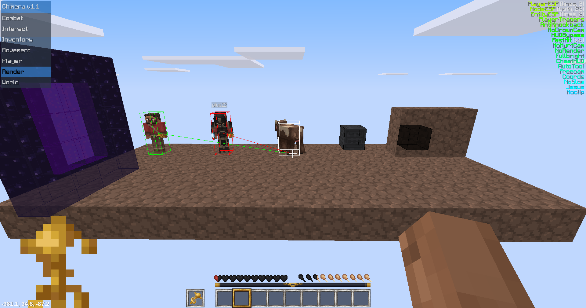

Chimera Client
==============

A minetest cheat client based off of [OtterClient](https://github.com/otterminetest/OtterClient/), which draws its roots from [DragonFire](https://github.com/dragonfireclient/dragonfireclient) and [WaspSaliva](https://repo.or.cz/waspsaliva.git).

This client's name is kind of a joke, as the "Chimera" is a mythological creature made up of many different creatures, just like this client is made up of many clients.

### Important info:
This client includes almost all CSM api additions from dragonfire, although it hasn't been documented (yet). It also includes many built-in client side mods and a new minimalistic design for the cheat menu.
It has not been tested extensively, so it may not be stable. If any bug or error is found, please open an issue about it.

# Features
### Cheat menu

  
Combat

  - AntiKnockback
  - AttachmentFloat: float above parent.
  - AutoAssist: don't completely kill your enemies. Turning this on automatically turns on PlayerAura.
  - AutoTotem: automatically puts a totem in your offhand. WARNING: Don't use on non-mcl servers.
  - AutoAim: aims at the nearest player.
  - CrystalSpam: automatically puts end crystals at another player's position and detonates it.
  - EntityAura: auto-hit entities.
  - PlayerAura: auto-hit enemy players.

  
Interact

  - AutoDig: automatically dig pointed block
  - AutoHit: automatically hit pointed entity
  - AutoPlace: automatically place wielded item at pointed block
  - AutoTool: automatically select best tool for digging/hitting
  - FastDig: dig at 10x speed
  - FastHit: hit at 6x speed. Can be modified using the `.fasthit <multiplier>` chat command
  - FastPlace: instant block placing
  - InstantBreak: instant block breaking

  
Inventory

  - AutoEject
  - AutoPlanks
  - AutoRefill
  - EnderChest
  - Hand

  
Movement

  - AirJump: jump while in the air
  - AutoForward
  - AutoJump
  - AutoSneak: autosneak. This hides your nametag on some servers.
  - Freecam
  - GravityOverride
  - Jesus
  - JetPack
  - JumpOverride
  - NoSlow
  - PitchMove
  - SpeedOverride
  - Spider: climb walls

  
Player

  - AutoRespawn
  - NoFallDamage
  - Reach: extend interact distance
  - PrivBypass

  
Render

  - CheatHUD: show currently toggled cheats
  - Coords: show coords in bottom left of screen
  - EntityESP: show bounding boxes around entities
  - EntityTracers: show lines to entities
  - Fullbright
  - HUDBypass
  - NoDrownCam
  - NoHurtCam
  - NodeESP: can be configured using the `.search add <(optional) node_name>` chat command
  - NodeTracers: can be configured using the `.search add <(optional) node_name>` chat command
  - NoRender: skip rendering particles to reduce client lag
  - PlayerESP: show bounding boxes around players. Green = friendly, Red = enemy. Friends can be configured using the `.friend add <(optional) player_name>` chat command.
  - PlayerTracers: show lines to players. Green = friendly, Red = enemy. Friends can be configured using the `.friend add <(optional) player_name>` chat command.
  - TunnelESP: shows tunnels.
  - TunnelTracers: show lines to tunnels.
  - Xray: see blocks thru walls. Can be configured using the `.xray add <(optional) node_name>` chat command.

  
World

  - AutoTNT: Places TNT in a 3 blocks radius.
  - BlockLava
  - BlockWater
  - Nuke
  - Replace
  - Scaffold: Places blocks below you.
  - ScaffoldPlus: Places EVEN more blocks below you.
  - Silence

### Chat commands
- `.fasthit <multiplier>` set fasthit multiplier. FastHit needs to be turned on for this to be used.
- `.say <text>` send raw text
- `.tp <X> <Y> <Z>` teleport
- `.wielded` show itemstring of wielded item
- `.players` list online players
- `.kill` kill your own player
- `.sneak` toggle autosneak
- `.speed <speed>` set speed
- `.place <X> <Y> <Z>` place wielded item
- `.dig <X> <Y> <Z>` dig node
- `.break` toggle instant break
- `.setyaw <yaw>`
- `.setpitch <pitch>`
- `.respawn` respawn while in ghost mode
- `.xray`
    - `add <(optional) node_name>`: add a node to xray configuration (to see thru it). Can either add by node_name or by pointing at a node.
    - `del <(optional) node_name>`: remove a node from xray configuration
    - `list`: list xray nodes
    - `clear`: clear xray nodes
- `.search`
    - `add <(optional) node_name>`: add a node to nodeESP search. Can either add by node_name or by pointing at a node.
    - `del <(optional) node_name>`: remove a node from nodeESP search
    - `list`: list nodeESP nodes
    - `clear`: clear nodeESP nodes
- `.friend`
    - `add <(optional) player_name>`: add a friend. Can either add by player_name or by pointing at a player. Friends are server-specific.
    - `del <(optional) player_name>`: remove a friend
    - `list`: list all friends for the current server
    - `clear`: remove all friends for the current server
- `.ctf`
    - `add`: add current server to ctf servers list
    - `del`: delete current server from ctf servers list
    - `list`: view ctf servers list
    - `clear`: clear ctf servers list

# Compiling
- [Compiling on GNU/Linux](doc/compiling/linux.md)
- [Compiling on Windows](doc/compiling/windows.md)
- [Compiling on MacOS](doc/compiling/macos.md)
